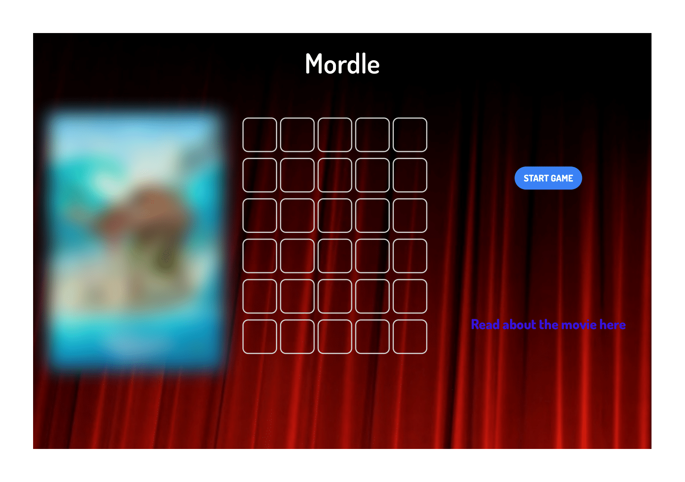

# Mordle

Deploy: https://doengesba.github.io/Mordle/
Repo: https://github.com/DoengesBA/Mordle

How the game works, is it looks
at each individual tile, the columns
and rows, to determine what
we've identified as the "gameboard".
Using JavaScript, we've created each
tile you see as it's own unique 
identity, which responds based off
of each keypress. We had to think 
outside of the box for this, as 
we did not want the user input when given
to spam and duplicate which could
ultimately disrupt how many tries 
the user has for the game. This 
also gave us the opportunity to
utilize "if statements". To allow
the user to go back to each previous
tile when pressing "backspace". 
When the user presses "Enter", 
logic executes and compares the 
input characters to determine if the 
user's guess is correct or not. 
For those unfamiliar with the rules
of Wordle, when the user submits a 
guess, if the user guesses the 
correct letter in the correct spot, 
the tile turns green. If the user
guesses a letter that is part of the 
answer but is in the wrong location,
the tile will turn yellow. If the 
user guesses letters not used in any
part of the word, the tile will not
change. The user has a total of 6 
guesses before the answer is presented
in bold to the side. If the user needs
a hint, we utilize an API that will fetch 
various articles about the movie,
which does ultimately give the answer away.

